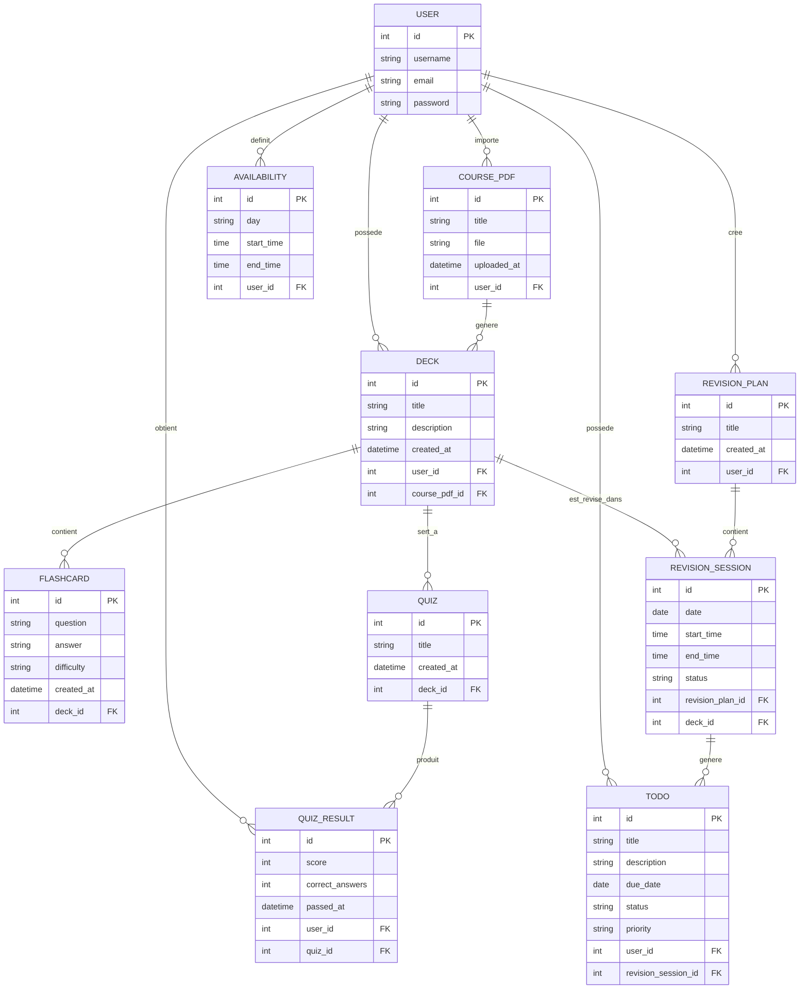

# MCD — Memora

```mermaid
erDiagram

    USER ||--o{ COURSE_PDF : importe
    USER ||--o{ DECK : possede
    USER ||--o{ QUIZ_RESULT : obtient
    USER ||--o{ AVAILABILITY : definit
    USER ||--o{ REVISION_PLAN : cree
    USER ||--o{ TODO : possede

    COURSE_PDF ||--o{ DECK : genere

    DECK ||--o{ FLASHCARD : contient
    DECK ||--o{ QUIZ : sert_a
    DECK ||--o{ REVISION_SESSION : est_revise_dans

    QUIZ ||--o{ QUIZ_RESULT : produit

    REVISION_PLAN ||--o{ REVISION_SESSION : contient

    REVISION_SESSION ||--o{ TODO : genere

    USER {
        int id PK
        string username
        string email
        string password
    }

    COURSE_PDF {
        int id PK
        string title
        string file
        datetime uploaded_at
        int user_id FK
    }

    DECK {
        int id PK
        string title
        string description
        datetime created_at
        int user_id FK
        int course_pdf_id FK
    }

    FLASHCARD {
        int id PK
        string question
        string answer
        string difficulty
        datetime created_at
        int deck_id FK
    }

    QUIZ {
        int id PK
        string title
        datetime created_at
        int deck_id FK
    }

    QUIZ_RESULT {
        int id PK
        int score
        int correct_answers
        datetime passed_at
        int user_id FK
        int quiz_id FK
    }

    AVAILABILITY {
        int id PK
        string day
        time start_time
        time end_time
        int user_id FK
    }

    REVISION_PLAN {
        int id PK
        string title
        datetime created_at
        int user_id FK
    }

    REVISION_SESSION {
        int id PK
        date date
        time start_time
        time end_time
        string status
        int revision_plan_id FK
        int deck_id FK
    }

    TODO {
        int id PK
        string title
        string description
        date due_date
        string status
        string priority
        int user_id FK
        int revision_session_id FK
    }
```