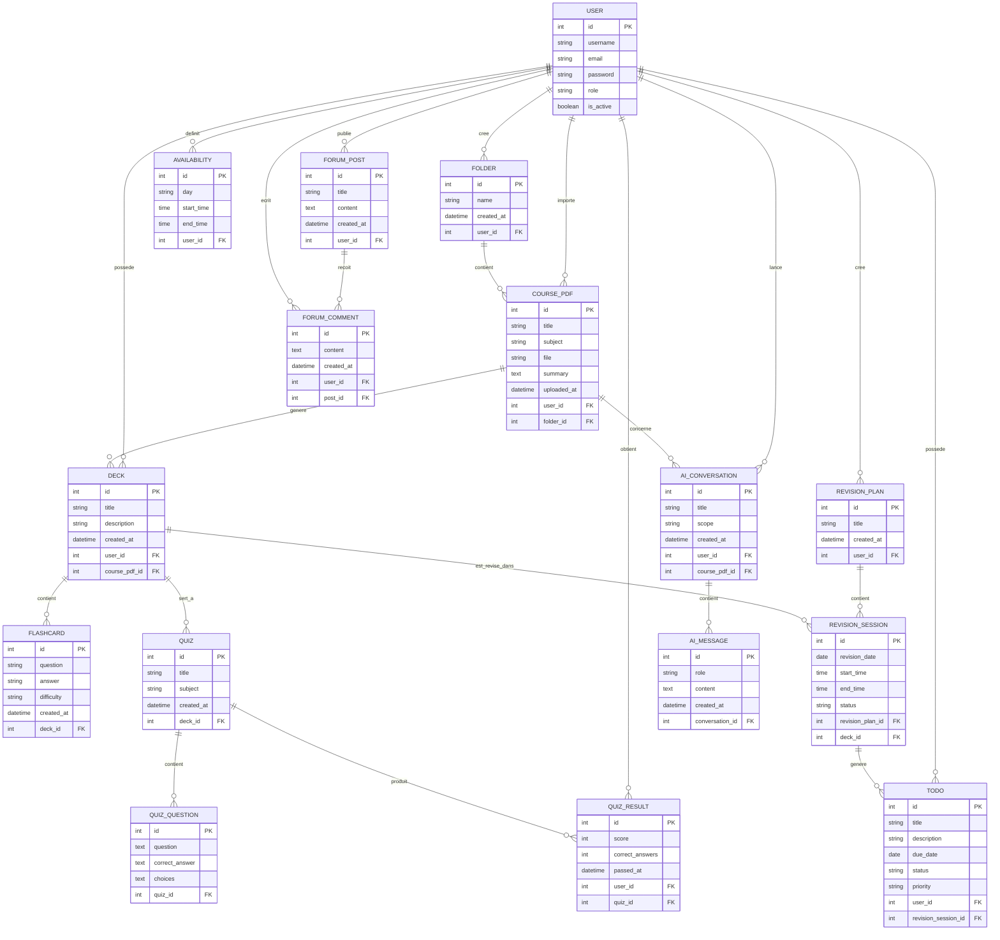

# MCD — Memora

```mermaid
erDiagram

    USER ||--o{ COURSE_PDF : importe
    USER ||--o{ FOLDER : cree
    FOLDER ||--o{ COURSE_PDF : contient

    USER ||--o{ DECK : possede
    COURSE_PDF ||--o{ DECK : genere
    DECK ||--o{ FLASHCARD : contient

    DECK ||--o{ QUIZ : sert_a
    QUIZ ||--o{ QUIZ_QUESTION : contient
    USER ||--o{ QUIZ_RESULT : obtient
    QUIZ ||--o{ QUIZ_RESULT : produit

    USER ||--o{ AVAILABILITY : definit
    USER ||--o{ REVISION_PLAN : cree
    REVISION_PLAN ||--o{ REVISION_SESSION : contient
    DECK ||--o{ REVISION_SESSION : est_revise_dans

    USER ||--o{ TODO : possede
    REVISION_SESSION ||--o{ TODO : genere

    USER ||--o{ FORUM_POST : publie
    FORUM_POST ||--o{ FORUM_COMMENT : recoit
    USER ||--o{ FORUM_COMMENT : ecrit

    USER ||--o{ AI_CONVERSATION : lance
    AI_CONVERSATION ||--o{ AI_MESSAGE : contient
    COURSE_PDF ||--o{ AI_CONVERSATION : concerne

    USER {
        int id PK
        string username
        string email
        string password
        string role
        boolean is_active
    }

    FOLDER {
        int id PK
        string name
        datetime created_at
        int user_id FK
    }

    COURSE_PDF {
        int id PK
        string title
        string subject
        string file
        text summary
        datetime uploaded_at
        int user_id FK
        int folder_id FK
    }

    DECK {
        int id PK
        string title
        string description
        datetime created_at
        int user_id FK
        int course_pdf_id FK
    }

    FLASHCARD {
        int id PK
        string question
        string answer
        string difficulty
        datetime created_at
        int deck_id FK
    }

    QUIZ {
        int id PK
        string title
        string subject
        datetime created_at
        int deck_id FK
    }

    QUIZ_QUESTION {
        int id PK
        text question
        text correct_answer
        text choices
        int quiz_id FK
    }

    QUIZ_RESULT {
        int id PK
        int score
        int correct_answers
        datetime passed_at
        int user_id FK
        int quiz_id FK
    }

    AVAILABILITY {
        int id PK
        string day
        time start_time
        time end_time
        int user_id FK
    }

    REVISION_PLAN {
        int id PK
        string title
        datetime created_at
        int user_id FK
    }

    REVISION_SESSION {
        int id PK
        date revision_date
        time start_time
        time end_time
        string status
        int revision_plan_id FK
        int deck_id FK
    }

    TODO {
        int id PK
        string title
        string description
        date due_date
        string status
        string priority
        int user_id FK
        int revision_session_id FK
    }

    FORUM_POST {
        int id PK
        string title
        text content
        datetime created_at
        int user_id FK
    }

    FORUM_COMMENT {
        int id PK
        text content
        datetime created_at
        int user_id FK
        int post_id FK
    }

    AI_CONVERSATION {
        int id PK
        string title
        string scope
        datetime created_at
        int user_id FK
        int course_pdf_id FK
    }

    AI_MESSAGE {
        int id PK
        string role
        text content
        datetime created_at
        int conversation_id FK
    }
```